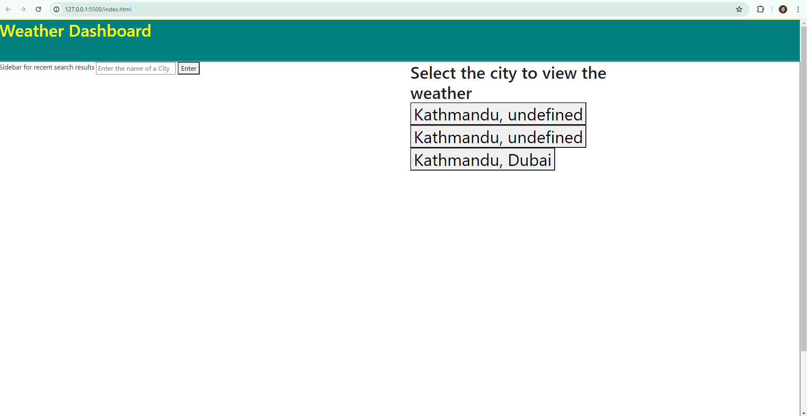

# Weather Dashboard

## Description

- A Website for looking at current weather conditions by entering a city name
- There is a search bar and an enter button

## Usage
- After loading the webpage a city name can be entered in the text input field
- After entering the name of a city and pressing enter, options to select the specific city will appear
- After selecting a city the temperature, windspeed, and humidity will appear of the selected city 

## Installation
-   View using an HTML viewer

## Screenshot

## Usage
-https://abhuraya.github.io/Weather_Dashboard/

## Credits

Programmer: Abhudaya Rayamajhi

## License

MIT License
